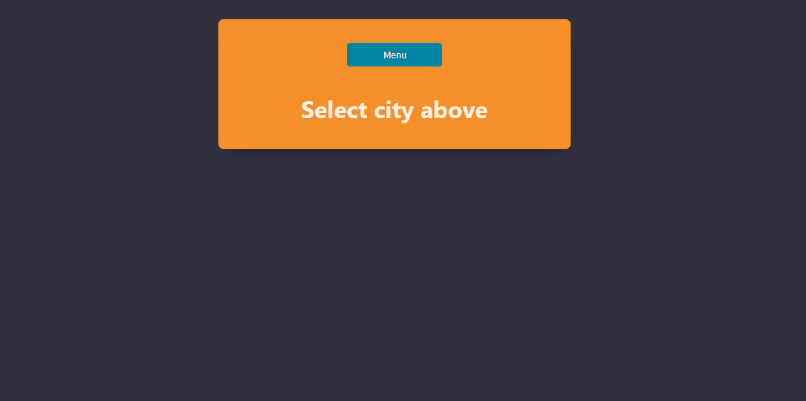

# Weather API
In this project we worked as an agile team using a scrumboard with daily standups to better plan and cooperate. 
The main priority of this project was to work in a way that fits test-driven development standards and to use a CI/CD pipeline to test and deploy our work in a more fluid way.
We also heavily used branches for all the different features we developed, and had code-reviews with at least two of the team members per pull request.

<h3>The application</h3>

We built an API with different endpoints to either get weather data about different cities, healthchecking and to see how many calls have been made since the API first started.

<h2>Tech stack</h2>
<h4>💻 Backend</h4>

- Framework: .NET 6.0.
- ASP.NET Minimal API.
- xUnit

<h4>🎨 Frontend</h4>

- Built using Vite React.
- Styled with StyledComponents for CSS in JS approach.

## Getting started
### Prerequisities
You need to have .NET installed on your computer, which can be found [here](https://dotnet.microsoft.com/en-us/download "here").
Other than that you also need to make sure you have installed npm.
`npm install npm@latest -g`
### Installation
1. `git clone https://github.com/Chrisvasa/FoxWeatherApp.git`
2. Either launch the application through an IDE or build the project and then launch it using an EXE.
3. To further interact with the API you can open the `WeatherAppReactClient` folder in VSCode and type the following commands which should be enough to get you started.
`npm i`
`npm run dev`
Then either press `o` or click the link that shows up.
### Usage
The demo below shows how you can interact and retrieve weather data, favorite cities and remove favorites.

## Team

- [Leo Stålenhag](https://www.github.com/L-stal)
- [Robert Johnson](https://www.github.com/Rohnson95)
- [Jonas Wettergrund](https://www.github.com/Wettergrund)
- [Daniel Berkowicz](https://www.github.com/Berkowicz)
- [Ilyas Kaya](https://www.github.com/AkiVonAkira)
- [Christopher Vasankari](https://www.github.com/Chrisvasa)
